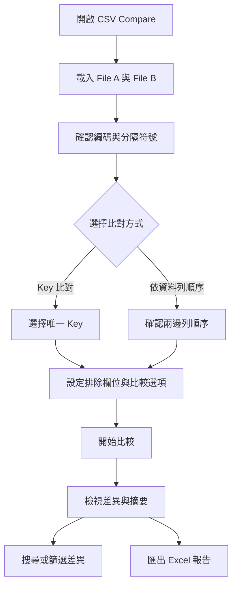
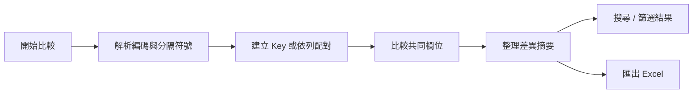

# CSV Compare 使用者操作手冊

CSV Compare 是一套 Windows 離線桌面工具，用來比對兩個 CSV 或其他分隔符號文字檔，找出資料列、欄位與儲存格內容的差異，並可將結果匯出成 Excel `.xlsx` 報告。

檔案會在本機處理，不需要登入、網路服務或上傳到雲端；原始 CSV 不會被修改。

## 目錄

- [快速開始](#快速開始)
- [整體使用流程](#整體使用流程)
- [介面區域](#介面區域)
- [載入檔案](#載入檔案)
- [選擇比對方式](#選擇比對方式)
- [設定 Key 與排除欄位](#設定-key-與排除欄位)
- [執行比對與閱讀結果](#執行比對與閱讀結果)
- [匯出 Excel](#匯出-excel)
- [資料安全與限制](#資料安全與限制)
- [常見問題](#常見問題)
- [維護者驗證](#維護者驗證)

## 快速開始

### 直接執行已產生的版本

若取得可攜版執行檔，直接雙擊：

```text
portable\CSVCompare.exe
```

也可以使用 Tauri 建立的安裝程式安裝後，從 Windows 開始功能表開啟 `CSV Compare`。

### 從原始碼啟動

維護者需要先安裝 Node.js LTS、Rust 與 Cargo，然後在專案根目錄執行：

```powershell
npm ci
npm run tauri dev
```

程式會啟動桌面視窗；開發用的 Vite 服務由 Tauri 設定自動啟動。

### 建立 Windows 發行版本

在 Windows 專案根目錄執行：

```text
build-exe.bat
```

成功後會產生：

- `src-tauri\target\release\csv-compare.exe`：Tauri 發行執行檔
- `src-tauri\target\release\bundle\`：NSIS / MSI 安裝包
- `portable\CSVCompare.exe`：可攜版複本

這些建置產物已由 `.gitignore` 排除，不應提交到 Git repository。

## 整體使用流程



## 介面區域

### File A / File B

左右兩個檔案面板分別代表待比較的來源檔案。每個面板包含：

- 檔案路徑輸入框
- `瀏覽`：開啟檔案選擇視窗
- `Encoding`：文字編碼
- `Delimiter`：欄位分隔符號
- 偵測結果：實際編碼、分隔符號與欄位數

### 比對設定

- 比對模式：Key 比對或依資料列順序比對
- Key 欄位：只顯示兩個檔案共有的欄位
- 排除比較欄位：選取後不比較該欄位內容
- 比較設定：忽略前後空白、忽略大小寫

## 載入檔案

1. 在 File A 按 `瀏覽` 選取第一個檔案。
2. 在 File B 按 `瀏覽` 選取第二個檔案。
3. 等待兩個面板完成檔案檢查。
4. 確認兩邊顯示的欄位數、編碼與分隔符號正確。
5. 若 `Auto` 判斷不正確，改用下拉選單手動指定。

支援的編碼包含：

- UTF-8
- Big5
- CP950
- UTF-16 LE
- UTF-16 BE

支援的分隔符號包含：

- Comma `,`
- Semicolon `;`
- Tab
- Pipe `|`
- Colon `:`
- Custom：單一 ASCII 字元

工具支援雙引號包覆欄位，也能處理欄位內容包含分隔符號、雙引號或換行的情況。

## 選擇比對方式

### 使用 Key 比對

Key 比對會依欄位值尋找對應資料列，因此兩個檔案的資料列順序可以不同。適合資料庫匯出檔、交易明細或需要跨版本對照的資料。

使用前請確認 Key 能唯一識別每一筆資料。若單一欄位不唯一，請選取多個欄位建立複合 Key，例如：

```text
客戶編號 + 交易日期 + 交易序號
```

### 依資料列順序比對

此模式會依第 1 列對第 1 列、第 2 列對第 2 列的順序比較，不需要 Key。只有在兩個檔案的資料列順序已經對齊時才適用。

## 設定 Key 與排除欄位

### Key 欄位

在 `Key 欄位` 清單勾選一個或多個共有欄位。畫面下方會顯示目前的 `Composite Key`。

Key 欄位必須符合以下條件：

- 兩個檔案都存在
- 不應為空白
- 組合後應能唯一識別資料列

若 Key 為空、部分空白或重複，結果會列出 Key 錯誤或 Duplicate Key，且不會宣稱資料完全相同。

### 排除比較欄位

在 `排除比較欄位` 勾選不需要比較的欄位，例如匯出時間、產製時間或每次匯出都會變動的欄位。Key 欄位不能同時被排除。

### 比較設定

- `忽略前後空白`：比較一般欄位內容時，忽略值前後的空白。
- `忽略大小寫`：比較一般欄位內容時，忽略英文字母大小寫。

這些設定只影響比較判斷，不會修改原始檔，也不會改寫匯出的原始值。

## 執行比對與閱讀結果

按下 `開始比較` 後，程式會在背景處理檔案，畫面會顯示進度。檔案很大時可以按 `取消比較` 停止作業。

完成後會顯示摘要與差異表，常見差異類型如下：

| 類型 | 意義 |
| --- | --- |
| `Value Changed` | 相同 Key 的欄位值不同 |
| `A Only` | 只存在於 File A |
| `B Only` | 只存在於 File B |
| `Column A Only` | 只存在於 File A 的欄位 |
| `Column B Only` | 只存在於 File B 的欄位 |
| `Duplicate Key` | Key 在同一檔案中出現多次 |
| `Empty Key` | Key 全部為空 |
| `Incomplete Key` | 複合 Key 只有部分欄位有值 |

結果摘要會顯示資料列數、相同筆數、不同筆數、A Only、B Only、不同儲存格數，以及兩邊的 Duplicate Key 數量。



結果上方顯示 `資料內容不同`，不一定代表兩個檔案的每個字元都不同；也可能是因為：

- Key 重複，無法唯一配對
- Key 空白或不完整
- 某些欄位只存在於其中一個檔案
- 資料列或欄位值確實不同

## 搜尋與篩選結果

在結果區上方可以：

- 搜尋 Key、資料列編號、欄位名稱、值或差異類型
- 依 `Value Changed`、`A Only`、`B Only`、`Column Difference`、`Duplicate Key`、`Key Error` 篩選
- 按 `重新比較` 返回目前設定重新執行

## 匯出 Excel

1. 比對完成後按 `匯出 Excel`。
2. 選擇輸出位置與檔名。
3. 儲存 `.xlsx` 報告。

報告會保留摘要、差異、欄位差異、排除欄位與 Duplicate Key 等資訊。匯出失敗時，請先確認目標資料夾可寫入，且同名 Excel 檔案沒有正被 Excel 開啟。

## 資料安全與限制

- 檔案解析、比較與 Excel 報告產生都在本機完成。
- 不需要網路、帳號、API Key 或雲端儲存。
- 原始 CSV 不會被覆寫。
- 匯出報告會寫入你選擇的位置，請依組織資料保護規範管理該報告。
- Key-based Compare 的 Key 必須具備唯一性；同一 Key 重複時，工具會保留該問題並在結果中標示，不會自行猜測應配對哪一筆。
- Row-by-row Compare 不會忽略資料列順序。

## 常見問題

### 為什麼同一個檔案和自己比較，仍顯示資料內容不同？

最常見原因是選用的 Key 不唯一。例如 `客戶編號` 中有兩筆 `001`，即使檔案內容完全相同，工具仍會標示 `Duplicate Key`。請改用複合 Key，例如 `客戶編號 + 交易日期 + 交易序號`，或在資料列順序確定一致時改用 Row-by-row Compare。

### Auto Encoding 無法使用怎麼辦？

請在 Encoding 下拉選單手動選擇正確編碼。繁體中文 Windows 檔案常見為 Big5 或 CP950；由 Excel 匯出的 Unicode 檔案則可能是 UTF-8 或 UTF-16。

### Auto Delimiter 判斷錯誤怎麼辦？

請依原始檔的實際格式手動選擇 Comma、Semicolon、Tab、Pipe、Colon 或 Custom。

### 兩個檔案欄位順序不同，可以比較嗎？

可以。Key-based Compare 會依欄位名稱對應，不要求欄位順序相同；Row-by-row Compare 則仍依資料列位置配對。

### 為什麼開始比較按鈕不能按？

請確認：

1. File A 與 File B 都已選取。
2. 兩個檔案都已完成檢查。
3. Auto Encoding 能可靠判斷，或已手動指定編碼。
4. 使用 Key 比對時至少選取一個 Key 欄位。
5. Custom 分隔符號是單一 ASCII 字元。

### 匯出 Excel 失敗怎麼辦？

確認輸出資料夾有寫入權限，並關閉目前已開啟的同名 `.xlsx` 檔案後再試一次。

## 維護者驗證

這些指令用於維護與測試，不是一般使用者操作必要步驟。

### 前端建置

```powershell
npm ci
npm run build
```

### Rust 測試

```powershell
cargo test --manifest-path src-tauri/Cargo.toml
```

測試資料位於 `test-data/`，涵蓋相同資料、內容變更、重複 Key、A/B Only、Quoted CSV 與自訂分隔符號等情境。

### 專案主要目錄

```text
src/                    React 使用者介面
src-tauri/src/          Tauri 指令與 Rust 比對核心
src-tauri/tests/        Rust 整合測試
test-data/              測試用 CSV / Delimited Text
build-exe.bat           Windows 發行版建置腳本
portable/               本機可攜版輸出位置，不納入 Git
```
